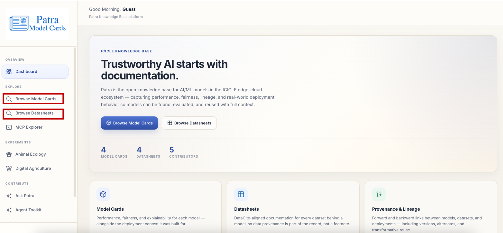
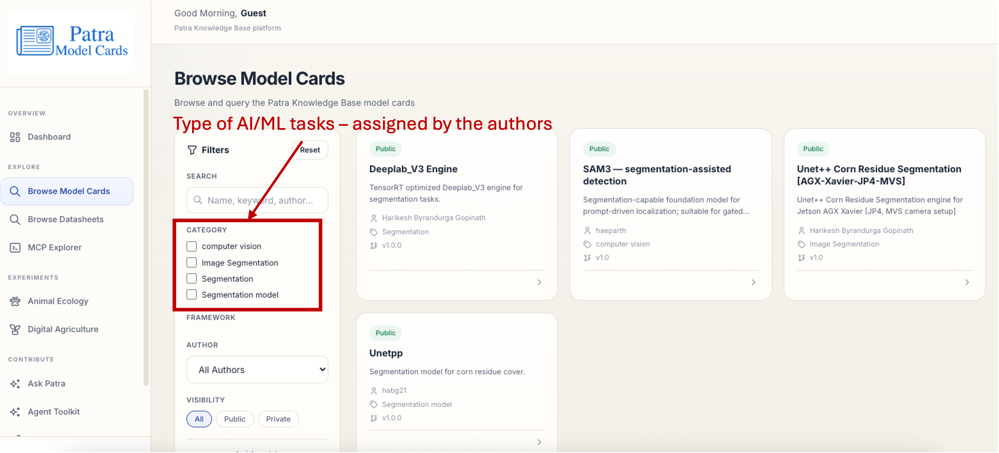
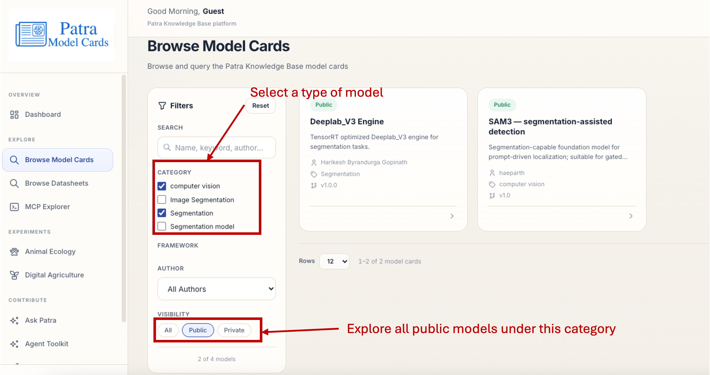
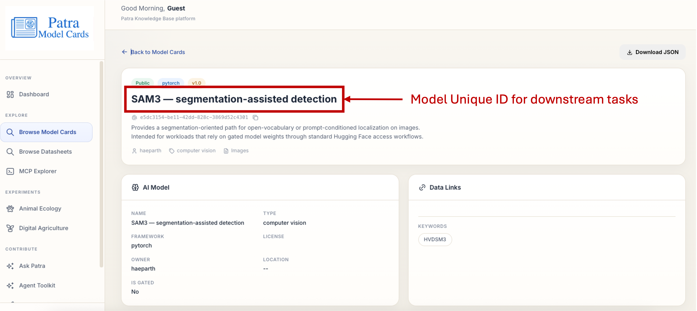

## Section 5: Computer Vision Models in Scientific Applications

<a href="https://docs.google.com/presentation/d/1fAVcmHwJi5wq4cHvSWFYw778mBJxm9YYMm9fwPTv1MM/edit?slide=id.g3cd6a51b6a2_0_31#slide=id.g3cd6a51b6a2_0_31" target="_blank">Lecture Slides</a>

## Stage 5.1: What is Patra?

Patra is the ICICLE ecosystem's open knowledge base for AI/ML models and the datasets behind them — its own tagline puts it well: "Trustworthy AI starts with documentation." Rather than treating models and data as separate, loosely-tracked files, Patra registers each as a structured, versioned record: a Model Card captures a model's framework, license, task type, gating status, and a unique ID meant for downstream use, while a Datasheet captures a dataset's description, creators, publisher, size, license, and its own unique ID and storage location. Researchers can browse and filter either catalog — by category, framework, author, or visibility (public vs. private) — to find what already exists before building something new, or explore an individual record in depth (its full description, creators, related identifiers, and a downloadable JSON) once they've found a candidate. Because every model and dataset carries its own unique ID, those records can be referenced directly by downstream tools — for benchmarking, retraining, or deployment — without re-uploading or re-describing the same data twice. Contributors can also register new records through Patra, so the catalog grows as new models are trained and new datasets are collected, keeping documentation attached to the artifact from the start rather than reconstructed after the fact.

## Stage 5.2: Browse Datasheets and Model Cards with Patra

### Step 5.2.1: Open the Patra Dashboard

Patra is the open knowledge base for AI/ML models in the ICICLE edge-cloud ecosystem, capturing performance, fairness, lineage, and real-world deployment behavior so models can be found, evaluated, and reused with full context. The landing page gives you two entry points, **Browse Model Cards** and **Browse Datasheets**, along with a running count of model cards, datasheets, and contributors currently in the knowledge base.

## Stage 5.3: Browse Datasheets with Patra

### Step 5.3.1: Search and Filter Datasheets

Click **Browse Datasheets** from the dashboard. Type in keywords for your dataset in the **Search** box, such as `animal` or `weed`, to filter the list by title, creator, or publisher. Use the **Visibility** filter to browse datasets marked `Public` by their author, or switch to `Private` to see your project or institute's private datasets.

### Step 5.3.2: Select a Datasheet

Once you've narrowed the list down, click on a datasheet of interest to explore more about its authors and dataset information.

### Step 5.3.3: Explore a Datasheet's Details

The datasheet page shows the dataset's description and publisher, along with its location under **Related Identifiers**. At the top, next to the dataset title, you'll also find the **Dataset Unique ID (UUID)**.

This UUID can be used in downstream tasks to download and use the dataset.

## Stage 5.4: Browse Model Cards with Patra

### Step 5.4.1: Filter Model Cards by Task

Click **Browse Model Cards** from the dashboard. The **Category** checkboxes in the Filters panel represent the type of AI/ML tasks assigned by the authors, such as `computer vision`, `Image Segmentation`, or `Segmentation`.

### Step 5.4.2: Narrow Down by Category and Visibility

Select a type of model by checking one or more categories, and use the **Visibility** toggle to explore all public models under that category.

### Step 5.4.3: Select a Model Card

From the filtered results, select a model card to explore its authors, model license, and more information.

### Step 5.4.4: Explore a Model Card's Details

The model card page shows the model's specs, including its framework, owner, license, and whether it's gated, alongside the **Model Unique ID (UUID)** next to the model title.

Just like the dataset UUID, this model UUID can be used in downstream tasks to download and use the model card.
