## Section 6: Smart Labeling Service for Object Detection

**AI-Assisted Data Labeling for Every Research Domain**

This tutorial walks through the Smart Labeler object detection workflow, from opening the
demo pipeline to producing a classified, exportable set of annotations. Smart Labeler pairs
manual annotation tools with AI-assisted detection (SAM 3, OWLv2) and embedding-based
classification (BioCLIP 2, DINOv3) so that large image datasets can be labeled quickly and
then reviewed rather than labeled entirely by hand.

**Contents**

- [Stage 6.1: Getting Started](#stage-61-getting-started)
  - [Step 6.1.1: Open Smart Labeler](#step-611-open-smart-labeler)
  - [Step 6.1.2: The Pipelines Dashboard](#step-612-the-pipelines-dashboard)
  - [Step 6.1.3: Upload Data to Tapis](#step-613-upload-data-to-tapis)
  - [Step 6.1.4: Create a New Pipeline](#step-614-create-a-new-pipeline)
- [Stage 6.2: Annotation](#stage-62-annotation)
  - [Step 6.2.1: The Image Annotator Layout](#step-621-the-image-annotator-layout)
  - [Step 6.2.2: Browsing Images with the File Explorer](#step-622-browsing-images-with-the-file-explorer)
  - [Step 6.2.3: Zero Shot Annotation and Filtering Tools](#step-623-zero-shot-annotation-and-filtering-tools)
  - [Step 6.2.4: AI-Assisted Annotation with SAM 3](#step-624-ai-assisted-annotation-with-sam-3)
  - [Step 6.2.5: Saving, Importing, and Downloading Annotations](#step-625-saving-importing-and-downloading-annotations)
- [Stage 6.3: Build Class Supports](#stage-63-build-class-supports)
  - [Step 6.3.1: Generate Class Supports](#step-631-generate-class-supports)
- [Stage 6.4: Optimize Patch Size](#stage-64-optimize-patch-size)
  - [Step 6.4.1: Compare Crop Sizes](#step-641-compare-crop-sizes)
- [Stage 6.5: Configure and Run Detection](#stage-65-configure-and-run-detection)
  - [Step 6.5.1: Configure the Detection Job](#step-651-configure-the-detection-job)
  - [Step 6.5.2: Visualize Proposals](#step-652-visualize-proposals)
- [Stage 6.6: Classification](#stage-66-classification)
  - [Step 6.6.1: Configure the Classification Job](#step-661-configure-the-classification-job)
  - [Step 6.6.2: Review Object Classification Results](#step-662-review-object-classification-results)

---

## Stage 6.1: Getting Started

### Step 6.1.1: Open Smart Labeler

Log in to https://public.tapis.io/, then click on the service as shown below.

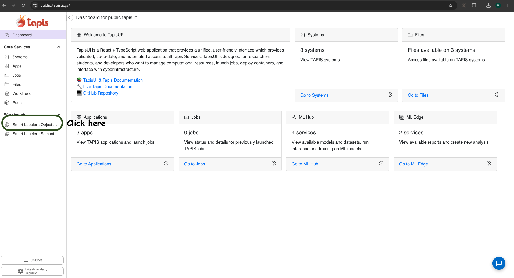

Navigate to the Smart Labeler. The landing page introduces the
service and gives you two entry points: **Get started**, which takes you into your own
pipelines, and **Live demo**, which opens a pre-loaded pipeline you can explore without
uploading any data.

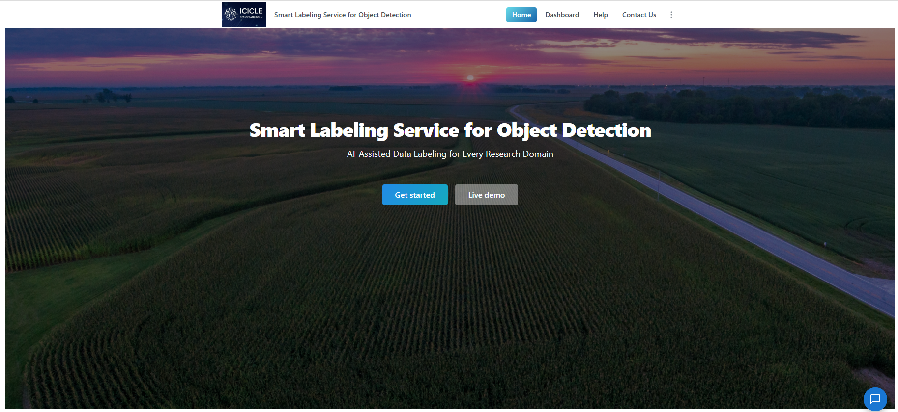

### Step 6.1.2: The Pipelines Dashboard

Every dataset you annotate lives inside a **pipeline**. The Pipelines dashboard lists all
pipelines you have access to, including a **Demo Pipeline** at the bottom that comes
pre-loaded with data so you can try the full annotation workflow without any setup.

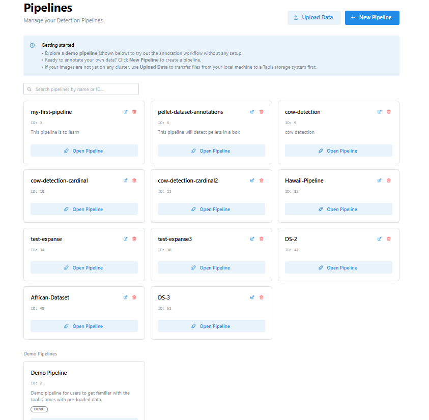

A few things worth noting on this page:

- Use the search bar to find a pipeline by name or ID.
- Each pipeline card shows an **Open Pipeline** button, plus edit and delete icons.
- If your images aren't yet on a Tapis-managed cluster, use **Upload Data** first (Step 1.3).
- To start annotating a brand-new dataset, use **New Pipeline** (Step 1.4).

### Step 6.1.3: Upload Data to Tapis

If your images live on your local machine, click **Upload Data** from the Pipelines
dashboard. This opens a dialog where you select the target Tapis storage system and
destination path, then either drag and drop files or use **Select Files** / **Select
Directory** to choose what to upload.

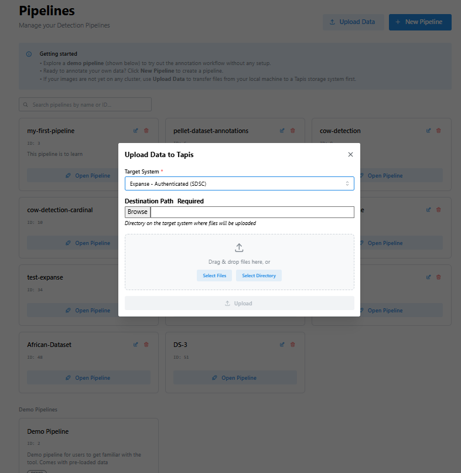

Once the upload finishes, your images are available on the target system and can be
referenced when you configure a pipeline or a detection job later in this tutorial.

### Step 6.1.4: Create a New Pipeline

Click **New Pipeline** to create a pipeline for your own dataset. Give it a **Pipeline
Name**, confirm the **SLURM Account** used for compute jobs, and optionally add a
**Description** so collaborators know what the pipeline is for.

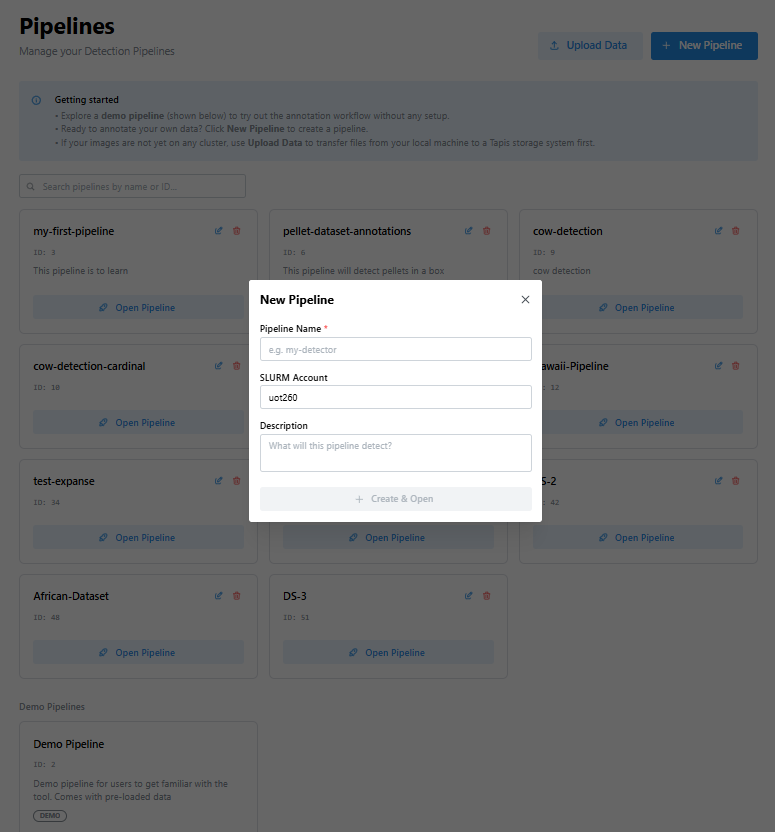

Here's the same dialog filled out for a pipeline that verifies dog breed annotations:

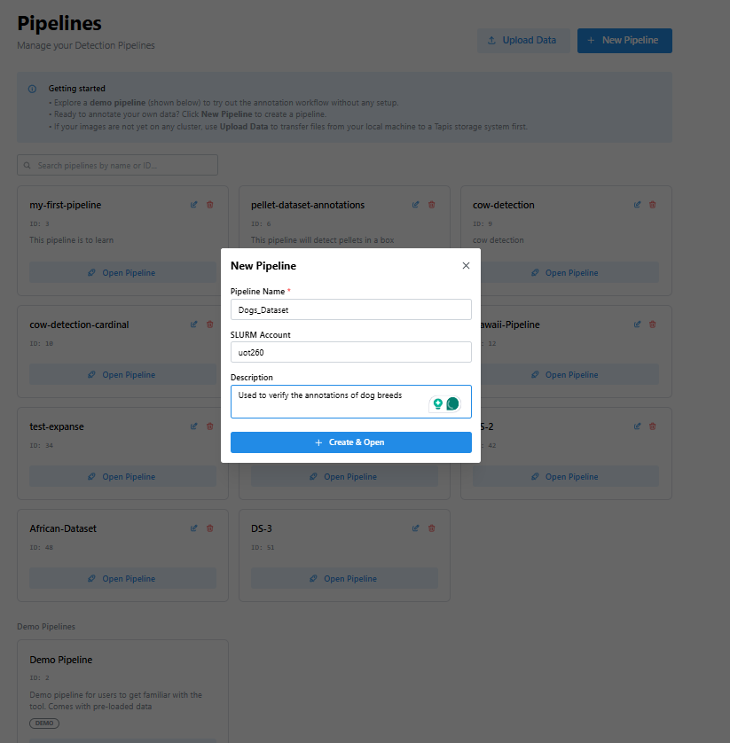

Click **Create & Open** to create the pipeline and jump straight into the Annotation stage.

---

## Stage 6.2: Annotation

Opening a pipeline drops you into the **Image Annotator**, the first stage in the pipeline
breadcrumb at the top of the screen. This is also where you'll return later to review and
correct AI-generated detections.

### Step 6.2.1: The Image Annotator Layout

The Image Annotator is split into three areas: the **File Explorer** on the left (collapsed
by default), the image canvas in the center, and the annotation controls on the right. The
pipeline breadcrumb across the very top always shows which stage you're in — **Annotation**
is active here, with every later stage listed to the right of it.

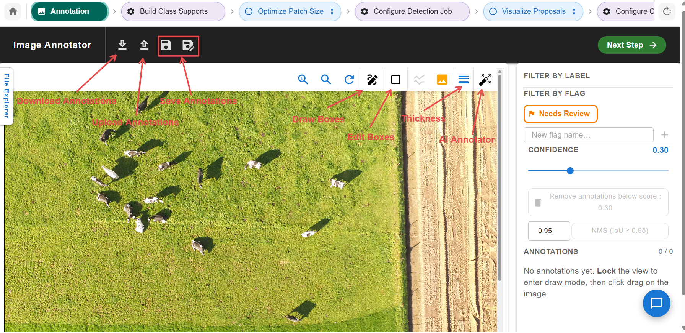

Across the top toolbar:

- **Download Annotations** and **Upload Annotations** — export or import an annotation file directly from this view.
- **Save Annotations** and the adjacent icon — save your current annotations to a Tapis file path.
- **Draw Boxes** — switch into manual bounding-box drawing mode.
- **Edit Boxes** — select and adjust existing boxes.
- **Thickness** — change the line weight used to render boxes.
- **AI Annotator** — open the SAM 3 segmentation-assisted annotation dialog (covered in Step 2.4).

### Step 6.2.2: Browsing Images with the File Explorer

Click the **File Explorer** tab on the left edge of the Annotator to expand it. It lists the
images available in the current pipeline's source folder, along with pagination controls at
the bottom. Click any thumbnail or filename to load that image into the canvas.

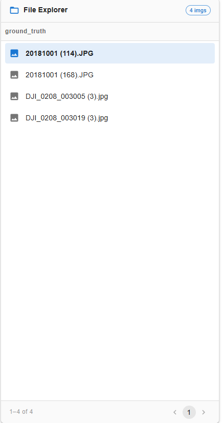

### Step 6.2.3: Zero Shot Annotation and Filtering Tools

The right-hand panel gives you fine-grained control over which annotations are visible and
lets you manage them individually.

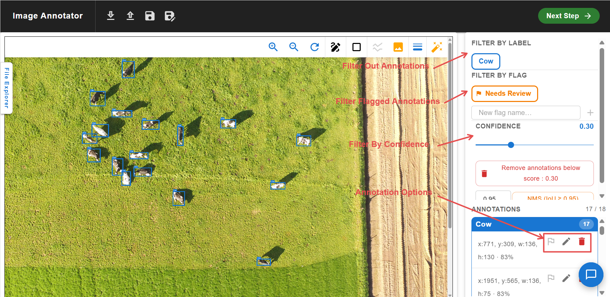

- **Filter by Label** — toggle visibility of annotations by class (e.g. `Cow`).
- **Filter by Flag** — show only annotations you've flagged, such as **Needs Review**. You can also define your own custom flags.
- **Filter by Confidence** — use the slider to hide low-confidence detections, and use **Remove annotations below score** to delete them outright.
- **Annotation Options** — each row in the annotation list has its own flag, edit, and delete controls, so you can review detections one at a time.

The list at the bottom shows every annotation for the current image, with its bounding box
coordinates and confidence score, grouped by class.

### Step 6.2.4: AI-Assisted Annotation with SAM 3

Rather than drawing every box by hand, you can click the **AI Annotator** icon to open the
**Segmentation Assisted Annotation (SAM 3)** dialog. SAM 3 supports two modes:

**Single Click** mode lets you label one object at a time. Set the **Label** you want applied,
then click directly on an object in the image; SAM 3 proposes a mask and bounding box around it.

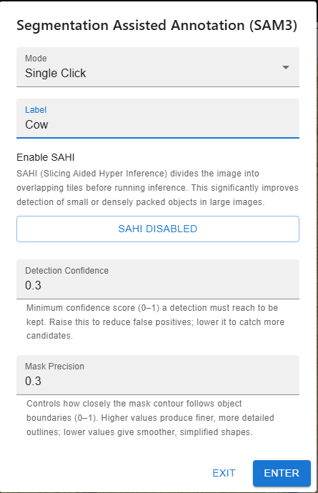

**Text Prompt** mode detects every instance of a class across the whole image from a text
description alone — no clicking required. This is the fastest way to bulk-annotate a common
class like `Cow`.

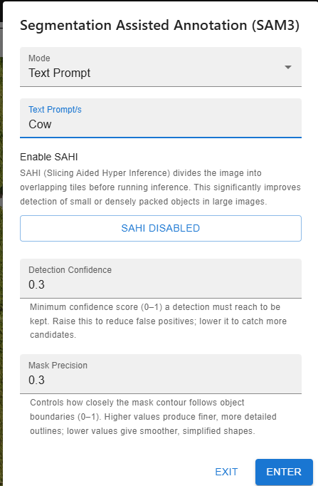

Both modes share the same tuning controls:

- **Enable SAHI** — Slicing Aided Hyper Inference splits the image into overlapping tiles before running inference, which significantly improves detection of small or densely packed objects in large images.
- **Detection Confidence** — the minimum confidence score a detection must reach to be kept. Raise it to reduce false positives, lower it to catch more candidates.
- **Mask Precision** — how closely the mask contour follows object boundaries. Higher values give finer, more detailed outlines; lower values give smoother, simplified shapes.

Click **ENTER** to run the detection and populate the canvas with proposed annotations, which
you can then review using the filtering and editing tools from Step 2.3.

### Step 6.2.5: Saving, Importing, and Downloading Annotations

Once you're happy with a set of annotations, click the **Save Annotations** icon in the
toolbar. Choose the target Tapis system and enter a **File Path**, or toggle **Default JSON**
to switch the export format. A **Format Preview** shows exactly what the saved file will look
like before you commit.

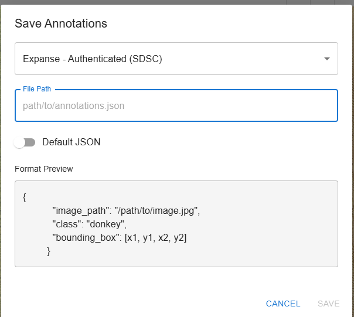

The **Download Annotations** icon offers a quick local export in either format:

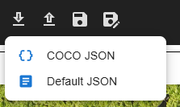

To bring in annotations you've already created elsewhere — for example, ground-truth labels
you want to compare against — use **Upload Annotations**. You can browse for a local file or
point to a file path already on the target Tapis system, and the same **Format Preview**
confirms the expected structure before upload.

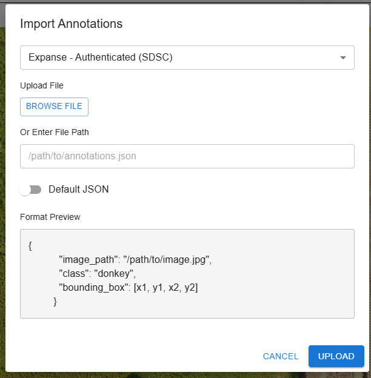

---

## Stage 6.3: Build Class Supports

Once you have a set of labeled reference examples, the next stage generates **class support
embeddings** — reference feature vectors for each class that the detection and classification
jobs later compare new proposals against.

### Step 6.3.1: Generate Class Supports

From the pipeline breadcrumb, open **Build Class Supports**. Fill in:

- **Job Name** — a descriptive name for this run.
- **System** — the compute system the job will run on.
- **Source Image Directory**, **Annotation File Path**, and **Output Directory** — browse to or type the full paths for your labeled images, their annotation file, and where results should be written.
- **Model Selection** — choose one or more embedding models. In this run, **BioCLIP 2**, **DINOv3 ViT-S/16**, and **OWLv2 Large Patch14 Ensemble** are all selected; selected models are listed for confirmation below the picker.
- **Crop/Patch Size** — the pixel dimensions used when cropping each labeled object for embedding.
- **Device** and **Method** — select the compute device and processing method (e.g. `Image`).

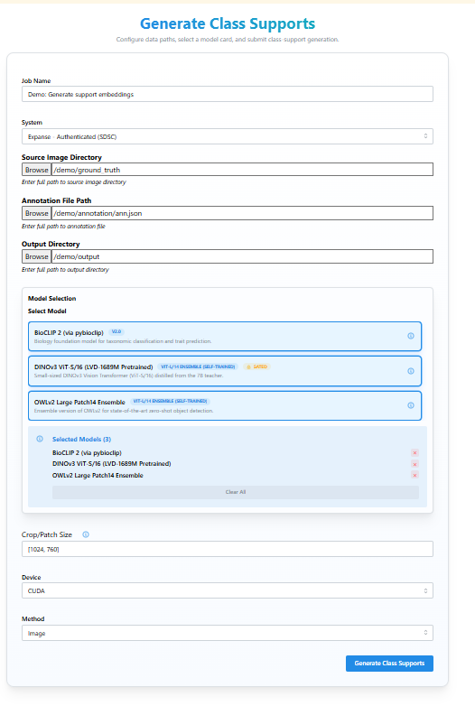

Click **Generate Class Supports** to submit the job. The resulting embedding files are what
you'll reference in Stage 5 when configuring the detection job.

---

## Stage 6.4: Optimize Patch Size

Detection accuracy on aerial or wide-angle imagery is sensitive to the crop size used during
inference — too large and small objects get lost, too small and context is lost. The
**Optimize Patch Size** stage lets you compare candidate crop sizes side by side on real
imagery before committing to one.

### Step 6.4.1: Compare Crop Sizes

Each entry under **Class Supports Files** corresponds to a job that was run with a different
crop size (for example, `314`, `960`, `1024`, and `2500` pixels). Select an entry to overlay
its resulting boxes on the canvas, adjust the crop size field, and click **Re-submit Job** to
try a new value. Once you're satisfied with a size, click **Save** to carry it forward.

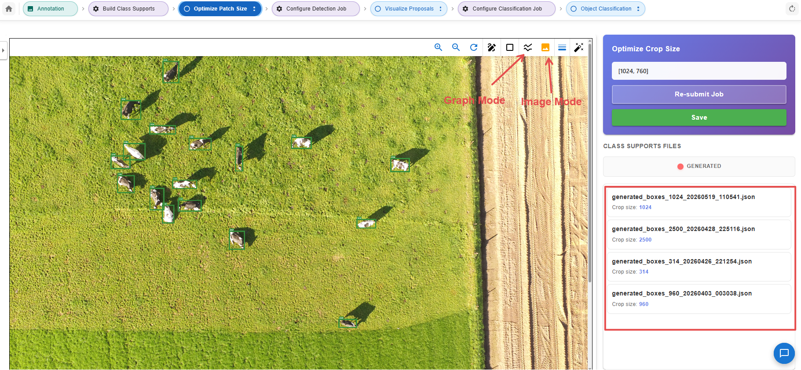

In this example, a crop size of `1024` produces well-fitted boxes around each cow in the
field — a good sign that this value balances detail against context for this dataset.

The toolbar above the canvas also includes an **Image Mode** / **Graph Mode** toggle. Image
Mode is the visual overlay shown above; switching to **Graph Mode** instead plots an IoU
Score against each annotation for every candidate crop size, letting you compare accuracy
quantitatively rather than by eye alone.

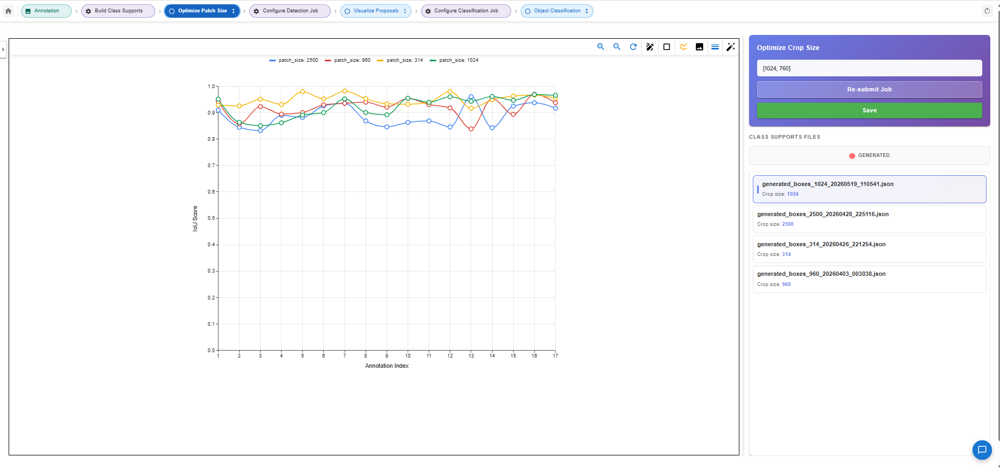

Here, `patch_size: 314` (yellow) tracks consistently higher IoU scores across most
annotations than the other candidates, while `patch_size: 2500` (blue) dips lowest —
useful confirmation to weigh alongside the visual comparison before clicking **Save**.

---

## Stage 6.5: Configure and Run Detection

### Step 6.5.1: Configure the Detection Job

Open **Configure Detection Job** from the breadcrumb. The left panel defines the job:

- **Job Name** and **Training System** — name the run and pick the compute system.
- **Query File Location** and **Output Directory** — the directory of images to run detection on, and where results should be written.
- **Model Selection** — pick one or more **Proposer** models (models that generate candidate boxes, such as **OWLv2 Large Patch14 Ensemble** and **Segment Anything Model 3**) and, further down the form, one or more **Embedder** models used for classification support.

The right panel, **Saved Configurations**, lets you reuse a previous setup — click a saved
card to load its models, thresholds, and settings instantly instead of re-entering them.

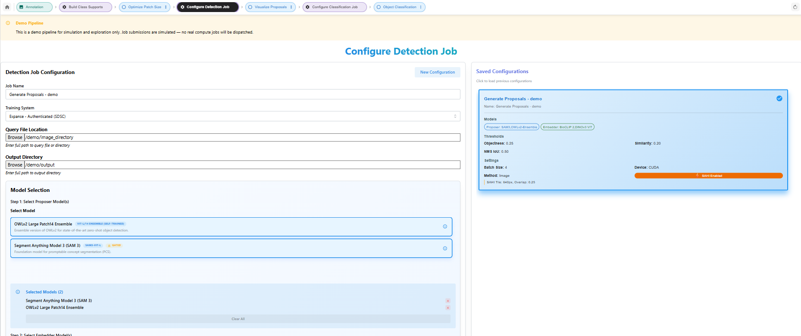

The selected configuration here uses the **SAM3, OWLv2-Ensemble** proposer pair together with
the **BioCLIP 2, DINOv3 ViT** embedder pair, an objectness threshold of `0.25`, a similarity
threshold of `0.20`, NMS IoU of `0.50`, batch size `4` on `CUDA`, with **SAHI enabled** at a
`640px` tile size and `0.25` overlap — the same SAHI tiling behavior introduced in Step 2.4,
now applied at the batch job level.

Scrolling down completes the rest of the form: **Step 2: Select Embedder Model(s)** (the
same picker pattern as the proposer models above), **Advanced Settings** (Batch Size,
Device, Method, and the SAHI tile size / overlap ratio fields), **Detection Thresholds**
(Objectness, Similarity, and NMS IoU), and **HPC Resource Settings** (Node Count, Cores Per
Node, Memory, and Max Minutes) for the compute job itself.

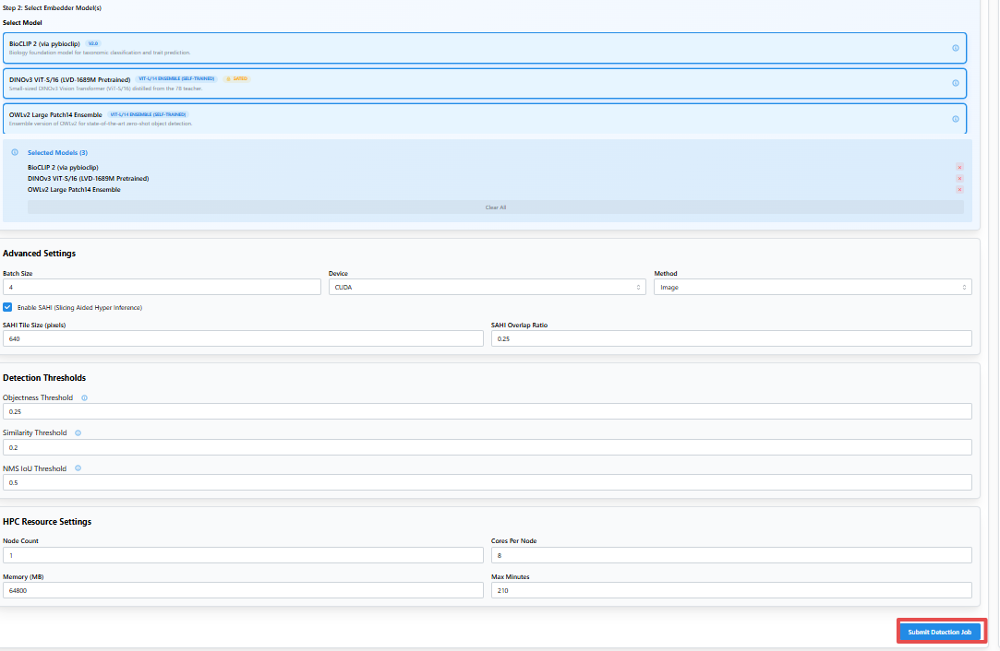

Once every field is set, click **Submit Detection Job** to launch the run.

### Step 6.5.2: Visualize Proposals

After the detection job completes, open **Visualize Proposals** to review what the models
found. The canvas shows each proposed box, and the right panel summarizes the exact job
configuration that produced them.

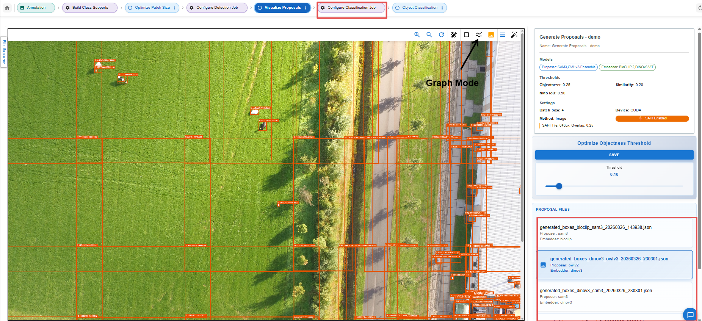

The orange grid overlaying the image shows the SAHI tiles the detection job sliced the image
into before running inference — a direct visual of the `640px` tile size and `0.25` overlap
configured in Step 5.1. The **Graph Mode** toggle in the toolbar switches this same canvas to
a plot instead of an image overlay.

The **Proposal Files** list on the right shows one result file per proposer/embedder
combination — here, `sam3` + `bioclip`, `owlv2` + `dinov3`, and `sam3` + `dinov3`. Select a
file to load its detections into the canvas above. An **Optimize Objectness Threshold**
slider sits just above the list, letting you raise or lower the cutoff and immediately see
which proposals survive.

Switching to **Graph Mode** plots Objectness Score against every detected proposal, sorted
from highest to lowest confidence:

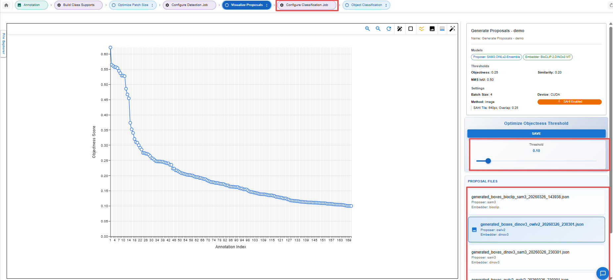

The sharp drop-off partway through the curve is a useful signal for where a sensible
objectness threshold sits — proposals to the left of the knee are confident detections,
while the long, low-scoring tail to the right is mostly noise worth filtering out before
moving on to classification.

---

## Stage 6.6: Classification

With detection proposals in hand, the final stage assigns each proposed box a class label by
comparing it against the class support embeddings built in Stage 3.

### Step 6.6.1: Configure the Classification Job

Open **Configure Classification Job**. Set a **Job Name** and confirm the **System**, then
tune:

- **Similarity Threshold** and **Objectness Threshold** — matching thresholds between 0 and 1 that control how confidently a proposal must match a class support before it's labeled.
- **Proposal & Class Support Mapping** — click **Add Mapping** to pair each proposal tensor file (the output of Stage 5) with its associated class support file (the output of Stage 3). If the detection job is still running, the proposal file will simply appear here once processing completes.

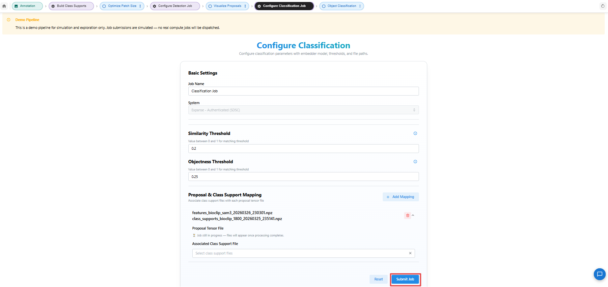

Click **Submit Job** to run classification across all mapped proposal files.

### Step 6.6.2: Review Object Classification Results

Once classification completes, open **Object Classification**, the final stage in the
breadcrumb, to see the fully labeled result. Each detected object is now outlined and tagged
with its assigned class directly on the image.

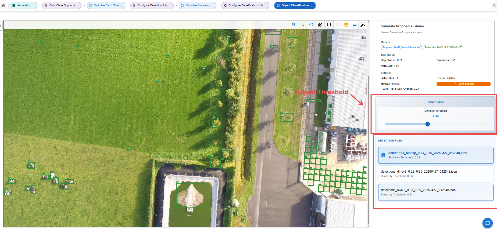

The right panel still shows the originating job configuration (models, thresholds, and
settings), along with a **Download** section and a **Similarity Threshold** slider you can
adjust to tighten or loosen which classified detections are shown, plus the same
**Detection Files** list from Step 5.2 so you can compare results across models before
exporting.

From here you can return to the **Annotation** stage at any point to spot-check individual
detections, apply the **Needs Review** flag to anything questionable, and correct or delete
boxes before exporting your final annotation file using **Save Annotations** or **Download
Annotations** (Step 2.5).

---

This completes the end-to-end Smart Labeler workflow: annotate a seed set of examples, build
class supports, tune your patch size, run and visualize detection proposals, classify them,
and review the results — turning a handful of manually labeled images into a fully annotated
dataset with AI assistance at every step.
